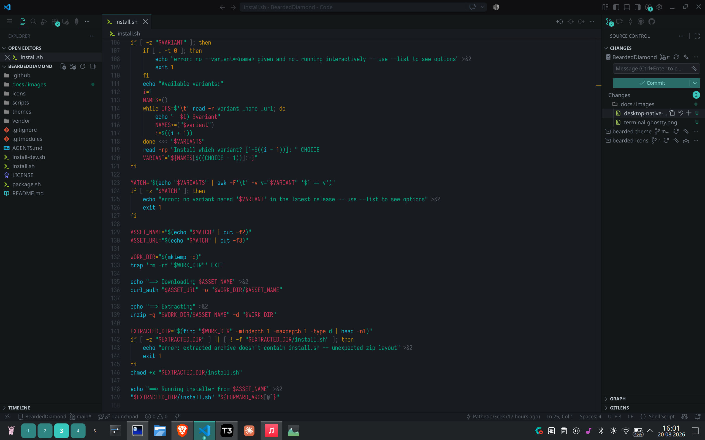
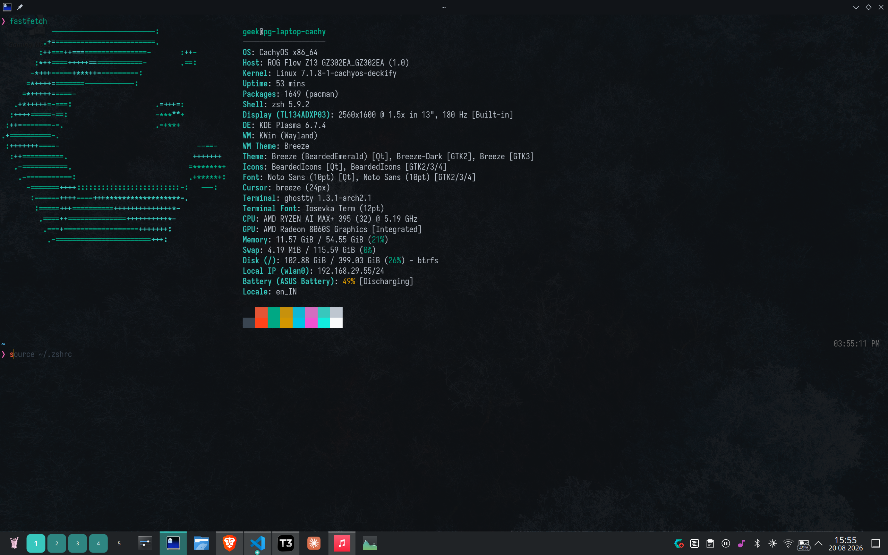
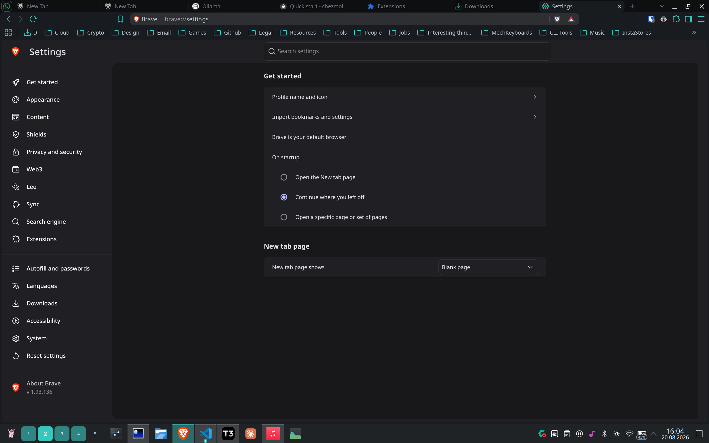
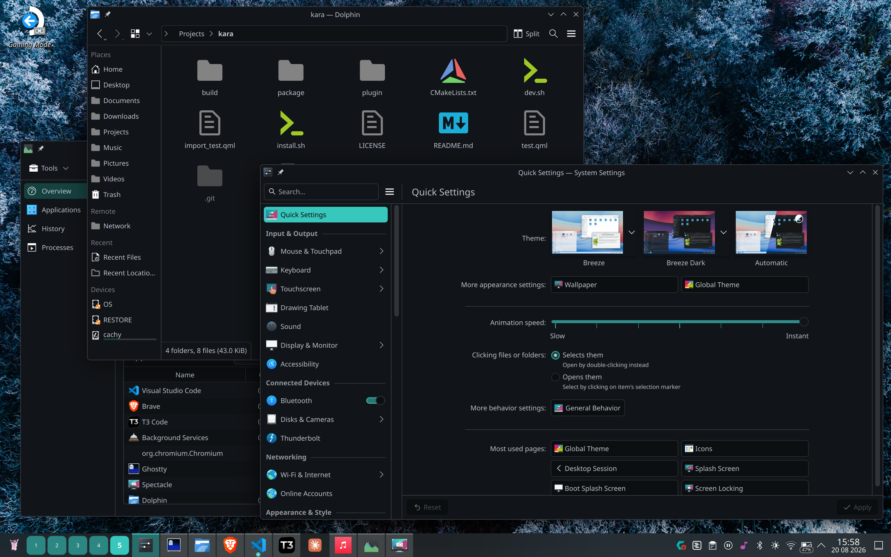

# Bearded Diamond — KDE Plasma 6 Global Theme

Cross-application themes generated from the [Bearded Theme](https://github.com/BeardedBear/bearded-theme)
VS Code color theme family and its companion "Bearded Icons" icon pack.
Each variant lives under `themes/<slug>/`; currently registered:
`black-and-diamond` ("Black & Diamond": cyan accent, gold highlight/cursor
tones), `black-and-gold` ("Black & Gold": gold accent throughout), and
`black-and-emerald` ("Black & Emerald": emerald/teal accent throughout). All
share the same near-black UI otherwise. The pipeline supports adding any of
the ~66 upstream variants — see [AGENTS.md](AGENTS.md).

`vendor/bearded-theme` and `vendor/bearded-icons` are git submodules of the
upstream sources. The color pipeline regenerates a variant's colors from
`vendor/bearded-theme` automatically — see [AGENTS.md](AGENTS.md) for how
(any AI coding agent can follow it directly). `vendor/bearded-icons` is
vendored for reference and version tracking; porting icon changes from it
is still a manual process (also documented in AGENTS.md), and the resulting
icon theme (`icons/BeardedIcons`) is shared across every variant rather than
generated per-theme. Clone with `git clone --recurse-submodules`, or run
`git submodule update --init` after a plain clone.

Each theme variant under `themes/<slug>/` includes:

- **Color scheme** (`color-schemes/<Ident>.colors`) — the full KDE color
  palette (windows, views, buttons, selection, tooltips, WM decorations).
- **Global theme package** (`look-and-feel/org.kde.<id>.desktop`) — ties the
  color scheme and the shared icon theme together, using Breeze for the
  widget style, window decoration, and cursors, plus a custom Plasma splash
  screen (`contents/splash`) shown while a Plasma session starts.
- **Plymouth boot theme** (`plymouth/<id>`) — the system boot splash shown
  before login, styled to match. Installed separately since it requires
  root and a system boot component.
- **Chrome theme** (`chrome-theme`) — a matching browser theme (frame,
  toolbar, tabs, omnibox, and new-tab-page colors) for Chrome and
  Chromium-based browsers. Installed separately since it lives in the
  browser, not the desktop.
- **Firefox theme** (`firefox-theme`) — the same palette mapped to Firefox's
  theme color keys (frame, tabs, toolbar, address bar, popups, sidebar,
  new-tab-page).
- **Ghostty theme** (`ghostty-theme/<Ident>`) — a terminal color scheme
  (16-color ANSI palette, background/foreground, cursor, selection) for the
  [Ghostty](https://ghostty.org) terminal emulator.

The **icon theme** (`icons/BeardedIcons`, shared by all variants) has
folder icons plus ~90 file-type (mimetype) icons ported from the Bearded
Icons VS Code extension, covering the most common languages and file
formats. Inherits Breeze Dark for everything not explicitly themed (app
icons, actions, devices, etc.).

## Screenshots

| VS Code | Terminal (Ghostty) |
| --- | --- |
|  |  |
| **Browser (Chrome)** | **Desktop / Native Apps** |
|  |  |

## Install

**Quickest way — no clone, no build.** Downloads the latest release,
lets you pick a variant, installs it. Needs only `curl` and `unzip`:

```sh
curl -fsSL https://raw.githubusercontent.com/patheticGeek/SuperTheme-BeardedThemes/main/install.sh | bash
```

Or, if you'd rather inspect it first (recommended before piping anything to
`bash`):

```sh
curl -fsSLO https://raw.githubusercontent.com/patheticGeek/SuperTheme-BeardedThemes/main/install.sh
chmod +x install.sh
./install.sh
```

| Flag               | Effect                                                                               |
| ------------------ | ------------------------------------------------------------------------------------ |
| `--variant=<name>` | Install a specific variant non-interactively (e.g. `BeardedGold`) — see `--list`     |
| `--all`            | Install the SuperTheme (every variant) non-interactively                             |
| `--list`           | Print available variants from the latest release and exit                            |
| `--apply`          | Apply the KDE global theme immediately after installing (forwarded to the installer) |
| `--system`         | Install system-wide instead of per-user (needs `sudo`, forwarded)                    |
| `--with-plymouth`  | Also install the boot splash(es) (needs `sudo`, forwarded)                           |

**From a local checkout** — for development. `themes/` is generated (not
committed to the repo — see [AGENTS.md](AGENTS.md)), so build it once after
cloning:

```sh
git clone --recurse-submodules https://github.com/patheticGeek/SuperTheme-BeardedThemes.git BeardedThemes
cd BeardedThemes
./scripts/build-all.sh   # builds themes/ for every registered variant (needs node/npm, python3+Pillow)
./install-dev.sh --apply
```

By default this installs every variant under `themes/` -- the color scheme,
KDE global theme, and Ghostty theme for each -- plus the shared icon theme,
into your user's config/XDG data directories
(`~/.local/share/...`, `~/.config/...`) — no root required. The Chrome and
Firefox themes are browser extensions and are always installed manually
(see below).

Options:

| Flag              | Effect                                                                                                               |
| ----------------- | -------------------------------------------------------------------------------------------------------------------- |
| `--theme=<slug>`  | Only install the named variant (see `themes/` for available slugs)                                                   |
| `--apply`         | Apply the KDE global theme immediately after installing (requires exactly one variant, i.e. combine with `--theme=`) |
| `--system`        | Install into `/usr/share/...` instead of `~/.local/share/...` (needs `sudo`)                                         |
| `--with-plymouth` | Also install the boot splash(es) to `/usr/share/plymouth/themes` and rebuild your initramfs (needs `sudo`)           |

```sh
./install-dev.sh --theme=black-and-diamond --apply
```

Without `--apply`, apply a theme manually via _System Settings → Appearance
→ Global Themes_.

The Plymouth boot theme is opt-in and separate from the rest because it's a
system-level, root-owned change that affects every boot and requires
rebuilding the initramfs — review `themes/<slug>/plymouth/<id>/<id>.plymouth`
before installing it.

## Chrome theme

`themes/<slug>/chrome-theme/` is an unpacked browser extension that themes
Chrome (and Chromium, Brave, Vivaldi, Edge, etc.). To install it:

1. Go to `chrome://extensions`.
2. Enable **Developer mode** (top right).
3. Click **Load unpacked** and select the `themes/<slug>/chrome-theme`
   directory for the variant you want.

It applies immediately and can be removed like any other extension. There's
nothing to publish to the Chrome Web Store here — it's meant for local use.

## Firefox theme

`themes/<slug>/firefox-theme/` is the same idea for Firefox. To install it:

1. Go to `about:debugging#/runtime/this-firefox`.
2. Click **Load Temporary Add-on…** and select
   `themes/<slug>/firefox-theme/manifest.json`.

Temporary add-ons are removed when Firefox restarts (Firefox only loads
unsigned themes this way outside of Nightly/Developer Edition). For a
permanent install, sign the theme via
[addons.mozilla.org](https://addons.mozilla.org) or run Firefox Developer
Edition/Nightly with `xpinstall.signatures.required` set to `false`.

## Ghostty theme

The installer copies each variant's `ghostty-theme/<Ident>` to
`~/.config/ghostty/themes/<Ident>`. Enable it by adding to your Ghostty
config:

```
theme = BeardedDiamond
```

## Building a distributable package

```sh
./package.sh [version]
```

Produces:

- `dist/SuperTheme-<version>.zip` — everything bundled
  together (`install.sh`, `README.md`, `LICENSE`, the shared icon theme,
  and every variant under `themes/`), so others can download, extract, and
  run `./install.sh` without cloning the repo.
- `dist/<Ident>-<version>.zip` — one per registered variant (e.g.
  `BeardedGold-<version>.zip`), containing just that variant plus the
  shared icon theme, `install.sh`, `README.md`, and `LICENSE`, for anyone
  who only wants a single theme.

Every push to `main` runs this automatically and publishes all of the
resulting zips in the same GitHub Release, titled with the short commit id
(see `.github/workflows/release.yml`).

## Uninstall

Remove the installed directories (per variant you installed):

```sh
rm -f  ~/.local/share/color-schemes/BeardedDiamond.colors
rm -rf ~/.local/share/icons/BeardedIcons
rm -rf ~/.local/share/plasma/look-and-feel/org.kde.beardeddiamond.desktop
rm -f  ~/.config/ghostty/themes/BeardedDiamond
# if installed with --with-plymouth:
sudo rm -rf /usr/share/plymouth/themes/beardeddiamond
sudo plymouth-set-default-theme -R <previous-theme>
```

Then switch to a different global theme in System Settings.

## Credits

Colors and icons are ported from [Bearded Theme](https://github.com/BeardedBear/bearded-theme)
and [Bearded Icons](https://github.com/BeardedBear/bearded-icons) by BeardedBear,
both licensed GPL-3.0. This repository is licensed GPL-3.0 as well; see
[LICENSE](LICENSE).
